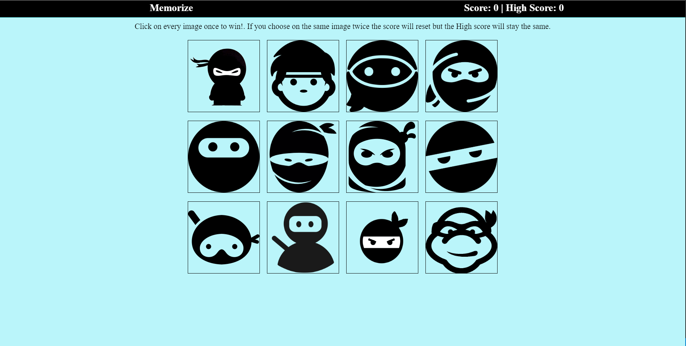
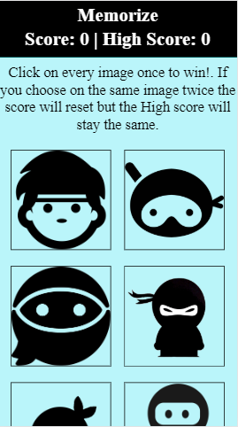

#### ** If cloning down do npm install then npm start

## Welcome to the react build memorize game
## this website is hosted on heroku and the link is https://mysterious-badlands-35869.herokuapp.com/

### The only page there is looks like this

### Mobile version

### The goal for this game is to select all the images without selecting the same image twice.
### Every time you select a image the images will shuffle.

#### The score updated when you have not selected a duplicate image and if you do the high score keeps track of the highest score during that session.

#### The score and title change title according if you were correct or not.